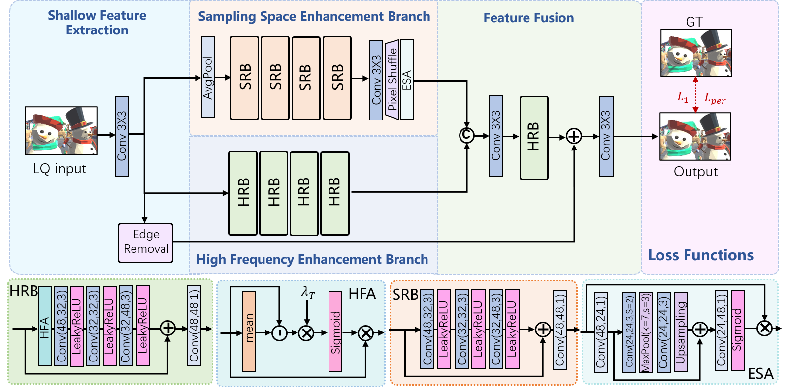

# CGIE

PyTorch implementation for **Joint Resolution and Rendering Artifacts Removal for Cloud Gaming Image** (TCSVT2026).

Paper page: [IEEE Xplore](https://ieeexplore.ieee.org/abstract/document/11422951)

## Architecture



## Demo

<video src="figs/DEMO_GameEnhancer_h.264.mp4" controls width="70%">
  Your browser does not support the video tag.
</video>

## Environment

Install the main dependencies:

```bash
pip install torch torchvision numpy opencv-python lmdb tensorboardX
```

## Inference

The default inference config is `options/test/test_spsr.json`:

```json
"dataroot_LR": "test_inputs",
"pretrain_model_G": "checkpoint/latest_G.pth"
```

Run:

```bash
python test.py -opt options/test/test_spsr.json
```

Results are saved to:

```text
results/CGIE/CloudGame/
```

## Training

Training uses paired low-quality and ground-truth images.

Expected dataset layout for the default config:

```text
AADataset/
|-- train/
|   |-- LR_train/
|   `-- GT_train/
`-- val/
    |-- LR_val/
    `-- GT_val/
```

Run:

```bash
python train.py -opt options/train/train_spsr.json
```

Important fields in `options/train/train_spsr.json`:

Training outputs are written under:

```text
experiments/<name>/
```

## Acknowledgement

This codebase follows the training/testing style of BasicSR and SPSR, with the current network adapted for cloud gaming image restoration.

- [BasicSR](https://github.com/xinntao/BasicSR)
- [SPSR](https://github.com/Maclory/SPSR)

```bibtex
@article{zhao2026joint,
  title={Joint Resolution and Rendering Artifacts Removal for Cloud Gaming Image},
  author={Zhao, Yang and Fan, Fan and Chen, Yuan and Li, Lin and Jia, Wei and Wang, Ronggang},
  journal={IEEE Transactions on Circuits and Systems for Video Technology},
  year={2026},
  publisher={IEEE}
}
```
